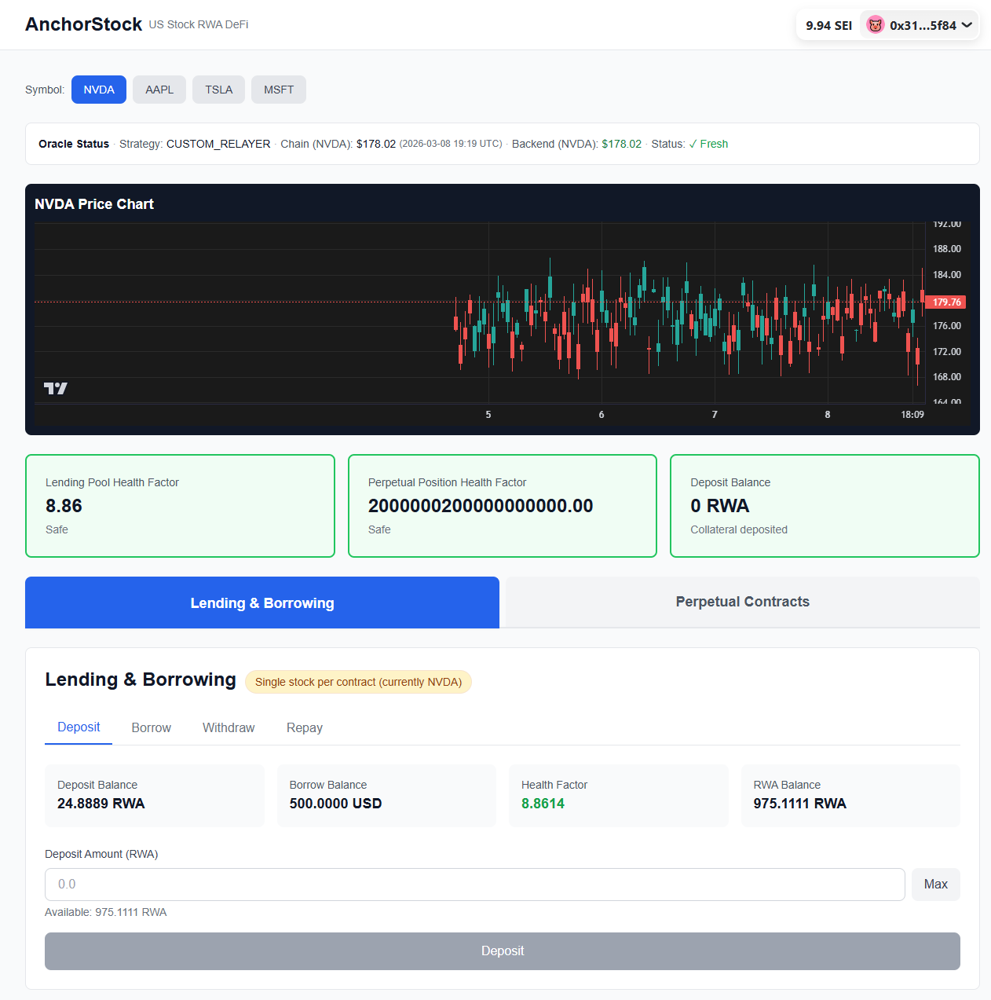
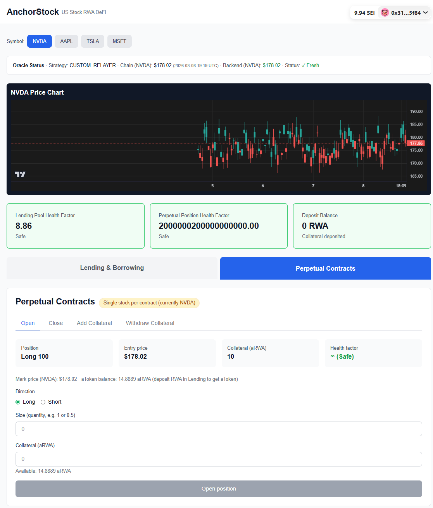

# AnchorStock

DeFi application for **single-stock** US stock RWA: **spot** (lending/borrowing) and **perp** (long/short). Deposit RWA as collateral to borrow USD (LendingPool), or use aToken as margin to open long/short perp positions (PerpEngine). **Currently only one stock per deployment is supported** (e.g. one NVDA RWA per LendingPool/PerpEngine/Oracle). Backend provides price relay (API → Kafka), on-chain Oracle updates, OHLCV storage (TimescaleDB), REST API for price/K-line, and a liquidation bot.

---

## 1. System Screenshots

| Description | Screenshot |
|-------------|------------|
| Lending: Deposit, Borrow, Withdraw, Repay |  |
| Perp: Open/close position, add/withdraw collateral |  |

---

## 2. Technical Architecture

### 2.1 Overall Topology

```
┌─────────────────────────────────────────────────────────────────────────────────┐
│  Frontend (Next.js + Wagmi)                                                      │
│  / → Oracle status, K-line chart, Lending (Deposit/Borrow/Withdraw/Repay), Perp  │
└───────────────┬─────────────────────────────────────────────────────────────────┘
                │ REST /api/price, /api/ohlcv    │ Contract reads/writes (Wagmi)
                ▼                               ▼
┌───────────────────────────────┐    ┌───────────────────────────────────────────────┐
│  cmd/api-server (Fiber :3001)  │    │  EVM chain (LendingPool, PerpEngine, Oracle)   │
│  GET /api/price/:symbol       │    │  RWA / USD / aToken contracts                  │
│  GET /api/ohlcv?symbol=&...   │    └───────────────────────────────────────────────┘
└───────────────┬───────────────┘
                │ reads
                ▼
┌───────────────────────────────┐     Kafka (stock-prices)
│  TimescaleDB / Redis           │              ▲
└───────────────────────────────┘              │ publish
┌───────────────────────────────┐              │
│  cmd/relayer                 │──────────────┘
│  Stock API → Kafka            │
└───────────────────────────────┘

┌───────────────────────────────┐    ┌───────────────────────────────┐
│  cmd/oracle-consumer         │    │  cmd/ohlcv-consumer            │
│  Kafka → batch update Oracle  │    │  Kafka → TimescaleDB (OHLCV)   │
└───────────────────────────────┘    └───────────────┬───────────────┘
                │                                    │
                ▼                                    ▼
┌───────────────────────────────┐    ┌───────────────────────────────┐
│  StockOracle (on-chain)       │    │  TimescaleDB (stock_prices)    │
└───────────────────────────────┘    └───────────────────────────────┘

┌───────────────────────────────┐
│  cmd/liquidation-bot         │
│  Health factor < 1 → liquidate │
└───────────────────────────────┘
```

### 2.2 Core Modules

| Module | Description |
|--------|-------------|
| **Contracts** | LendingPool (deposit RWA → aToken, borrow USD, LTV 70%, health factor), PerpEngine (aToken collateral, long/short, PnL, funding), StockOracle (price feed), USStockRWA, MockUSD, aToken |
| **Relayer** | Fetches stock prices from API (e.g. Alpha Vantage), publishes to Kafka `stock-prices`; no DB, no chain write |
| **Oracle Consumer** | Subscribes to Kafka, batches and calls Oracle `updatePrices` on-chain at interval (e.g. 30s) |
| **OHLCV Consumer** | Subscribes to Kafka, writes each price to TimescaleDB `stock_prices`; continuous aggregates for 1m/5m/1h/1d |
| **API Server** | Serves `/api/price/:symbol`, `/api/ohlcv` (from TimescaleDB/Redis), `/api/price-source/:symbol` (diagnostic) |
| **Liquidation Bot** | Discovers users with positions (LendingPool / PerpEngine), checks health factor; if &lt; 1.0, submits liquidation tx; optional Kafka listener for faster reaction |
| **Backfill** | Fetches historical OHLCV from Alpha Vantage, writes to TimescaleDB for K-line history |

### 2.3 Data Storage (K-line & Latest Price)

- **TimescaleDB**: K-line data is stored with **partitioning** (Hypertable by time) for efficient time-series writes and range queries; Continuous Aggregates materialize 1m/5m/1h/1d etc., and the API `/api/ohlcv` reads from these materialized views.
- **Redis**: Used to cache latest price and OHLCV query results to reduce database load; when Redis is not configured or unavailable, the API falls back to the DB.

---

## 3. Price Flow (Off-Chain → On-Chain)

Prices must be pushed on-chain because contracts read from the Oracle.

1. **Relayer** (periodically): Stock API → Kafka topic `stock-prices`.
2. **Oracle Consumer**: Consumes Kafka, batches by interval (e.g. 30s), calls `StockOracle.updatePrices(symbols, prices, timestamps)`.
3. **LendingPool / PerpEngine**: Read `oracle.getPrice(symbol)` for collateral value, mark price, and health factor.

---

## 4. Lending & Perp Contract Behavior

- **LendingPool**
  - Deposit RWA: user approves RWA to pool, calls `depositRWA(amount)`; pool mints 1:1 aToken to user.
  - Borrow USD: up to `deposit × price × LTV` minus current debt; linear interest from first borrow timestamp.
  - Multiple borrows and partial repay are supported; repay reduces interest first then principal. When debt reaches zero, next borrow resets the interest timestamp.
- **PerpEngine**
  - Collateral is **aToken** (obtained by depositing RWA in LendingPool). User approves aToken to PerpEngine, then opens long/short with size and collateral amount.
  - PnL and health factor use Oracle price; stale price (e.g. market closed) can revert (Market Hours Trap).
- **Single stock per deployment**: Current design has one RWA (e.g. NVDA) per LendingPool/PerpEngine/Oracle deployment; multi-stock would require multiple deployments or contract changes.

---

## 4.1 Important Notes (TradFi vs DeFi)

- **Market Hours Trap**: Crypto trades 24/7; US equities do not (weekends and after-hours). If the market gaps down over the weekend, the on-chain Oracle price may stay stale until the next open, so positions cannot be liquidated in time—gap risk can cause bad debt. The contracts detect stale prices (e.g. Market Hours Trap) and may revert; the README should make this TradFi/DeFi time mismatch explicit.

---

## 5. Code Structure

### 5.1 Repository Layout

```
AnchorStock/
├── backend/
│   ├── cmd/
│   │   ├── api-server/     # HTTP API (price, OHLCV)
│   │   ├── relayer/        # Stock API → Kafka
│   │   ├── oracle-consumer/# Kafka → Oracle updatePrices
│   │   ├── ohlcv-consumer/ # Kafka → TimescaleDB
│   │   ├── liquidation-bot/# Health check + liquidate
│   │   └── backfill/       # Historical OHLCV → DB
│   ├── internal/
│   │   ├── config/         # Env-based config
│   │   ├── relayer/        # Fetch + Kafka publish
│   │   ├── kafka/          # Producer, Consumer
│   │   ├── blockchain/     # Oracle client, contract client
│   │   ├── database/       # TimescaleDB (schema, insert, OHLCV views)
│   │   ├── cache/          # Redis
│   │   ├── liquidation/    # Bot, position discovery, health check, tx watcher
│   │   └── ...
│   └── pkg/
│       └── price/          # StockPrice, fetcher (API / mock), historical
├── contracts/
│   ├── src/
│   │   ├── LendingPool.sol
│   │   ├── PerpEngine.sol
│   │   ├── StockOracle.sol
│   │   ├── tokens/         # USStockRWA, MockUSD, aToken
│   │   ├── mocks/          # MockPyth
│   │   └── libraries/
│   ├── script/
│   │   ├── Deploy.s.sol
│   │   ├── MintRWA.s.sol
│   │   └── Verify.s.sol
│   └── test/
├── frontend/
│   └── app/
│       ├── page.tsx        # Main page: symbol, K-line, Lending/Perp tabs
│       ├── components/     # LendingPanel, PerpPanel, KLineChart, OracleStatus, Header
│       ├── lib/            # contracts.ts, wagmi config
│       └── types/
├── docker/
│   ├── docker-compose.yml  # Zookeeper, Kafka, TimescaleDB, Redis, Kafka UI, Redis Commander
│   └── initdb/             # TimescaleDB init (hypertable, continuous aggregates)
├── README.md
└── README_zh.md
```

### 5.2 Key Flows

- **Price pipeline**: Relayer → Kafka → Oracle Consumer → chain; same Kafka → OHLCV Consumer → TimescaleDB.
- **Frontend**: Connects wallet (Wagmi), reads LendingPool (deposits, borrows, health), PerpEngine (positions), Oracle (price); calls backend for latest price and OHLCV; user actions (deposit, borrow, repay, open/close position) via `writeContract` / `writeContractAsync`.
- **Liquidation**: Bot discovers active users from events or config, checks health factor (LendingPool + PerpEngine), submits `liquidate` / perp liquidation when HF &lt; 1.0; liquidator receives a **5% bonus**.

---

## 6. Development Setup

### 6.1 Dependencies

- **Go** 1.21+ (backend)
- **Node.js** 18+ (frontend)
- **Foundry** (contracts: forge, anvil, cast)
- **Docker / Docker Compose** (Kafka, TimescaleDB, Redis)

### 6.2 Clone and Config

```bash
git clone https://github.com/0xarthurlabs/AnchorStock
cd AnchorStock
```

### 6.3 Start Infrastructure (Docker)

```bash
cd docker
docker-compose up -d
```

- **Kafka** `localhost:9092` (host); Relayer on host must use `KAFKA_BROKER=localhost:9092`
- **TimescaleDB** `localhost:5432` (user/pass/db: anchorstock)
- **Redis** `localhost:6379`
- **Kafka UI** `localhost:8082`, **Redis Commander** `localhost:8081`

### 6.4 Backend

Create `backend/.env` (see backend README for full list). Minimum:

- `RPC_URL`, `PRIVATE_KEY` (for Oracle Consumer / Liquidation; Relayer does not need chain)
- `KAFKA_BROKER=localhost:9092`, `KAFKA_TOPIC_PRICE=stock-prices`
- `DB_*` for TimescaleDB, `REDIS_*` optional
- `STOCK_API_KEY`, `STOCK_API_URL` for Relayer (e.g. Alpha Vantage)

```bash
# Terminal 1: Relayer (API → Kafka)
go run backend/cmd/relayer/main.go

# Terminal 2: Oracle Consumer (Kafka → chain)
go run backend/cmd/oracle-consumer/main.go

# Terminal 3: OHLCV Consumer (Kafka → TimescaleDB)
go run backend/cmd/ohlcv-consumer/main.go

# Terminal 4: API server (price + OHLCV endpoints)
go run backend/cmd/api-server/main.go

# Optional: Liquidation bot
go run backend/cmd/liquidation-bot/main.go

# Optional: Backfill K-line history
go run backend/cmd/backfill/main.go --symbol=NVDA --interval=5min
```

### 6.5 Contracts

Create `contracts/.env` with `PRIVATE_KEY` (and optional `ETH_RPC_URL`). Deploy (e.g. local Anvil or testnet):

```bash
cd contracts
forge build
# Local
forge script script/Deploy.s.sol:DeployScript --rpc-url http://localhost:8545 --broadcast
# Testnet (example)
forge script script/Deploy.s.sol:DeployScript --rpc-url <RPC_URL> --broadcast --chain-id <CHAIN_ID> --gas-estimate-multiplier 150
```

Copy deployed addresses (LendingPool, PerpEngine, Oracle, RWA_TOKEN, USD_TOKEN, aToken) to frontend env.

**MintRWA (required before users can deposit):** RWA is minted only by the USStockRWA owner. After deployment, the deployer (owner) must mint RWA to user addresses; otherwise they have zero RWA and cannot call `depositRWA`. Use the MintRWA script:

```bash
# In contracts/.env set: PRIVATE_KEY, RWA_TOKEN=<USStockRWA address>, MINT_TO=<user address>, optional MINT_AMOUNT (default 1000 = 1000e18)
forge script script/MintRWA.s.sol:MintRWA --rpc-url <RPC_URL> --broadcast
```

Without this step, the lending/perp flow cannot start (no RWA to deposit).

### 6.6 Frontend

Create `frontend/.env.local`:

```env
NEXT_PUBLIC_BACKEND_API_URL=http://localhost:3001
NEXT_PUBLIC_ORACLE_CONTRACT_ADDRESS=0x...
NEXT_PUBLIC_LENDING_POOL_CONTRACT_ADDRESS=0x...
NEXT_PUBLIC_PERP_ENGINE_CONTRACT_ADDRESS=0x...
NEXT_PUBLIC_RWA_TOKEN_CONTRACT_ADDRESS=0x...
NEXT_PUBLIC_USD_TOKEN_CONTRACT_ADDRESS=0x...
NEXT_PUBLIC_A_TOKEN_CONTRACT_ADDRESS=0x...
NEXT_PUBLIC_CHAIN_ID=1328
```

```bash
cd frontend
npm install
npm run dev
```

Proxy: frontend calls backend at `NEXT_PUBLIC_BACKEND_API_URL` for `/api/price/:symbol` and `/api/ohlcv`; contract calls go to the chain configured in Wagmi.

### 6.7 Config Summary

| Component | Key config |
|-----------|------------|
| Backend | `RPC_URL`, `PRIVATE_KEY`, `KAFKA_BROKER`, `KAFKA_TOPIC_PRICE`, `DB_*`, `STOCK_API_KEY`, `ORACLE_CONTRACT_ADDRESS`, `LENDING_POOL_*`, `PERP_ENGINE_*` |
| Frontend | `NEXT_PUBLIC_BACKEND_API_URL`, all `NEXT_PUBLIC_*_CONTRACT_ADDRESS`, `NEXT_PUBLIC_CHAIN_ID` |
| Contracts | `PRIVATE_KEY` in `contracts/.env` |

---

## 7. API Reference

### 7.1 Backend API (cmd/api-server)

- `GET /health` — Health check
- `GET /api/price/:symbol` — Latest price for symbol (e.g. NVDA); from Redis or DB
- `GET /api/ohlcv?symbol=NVDA&interval=1h&limit=100` — OHLCV for K-line chart; interval can be 1m, 5m, 15m, 1h, 4h, 1d
- `GET /api/price-source/:symbol` — Diagnostic: whether source is API or mock, rate limit info

Default port: 3001 (overridable via env).

### 7.2 Liquidation Bot

- `GET /health` — Health check
- `GET /metrics` — Metrics
- `GET /status` — Status

---

## 8. License

This project is licensed under the **GPL-3.0** license. See the repository for the full text.
