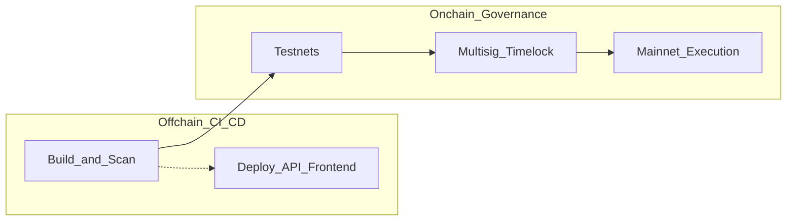
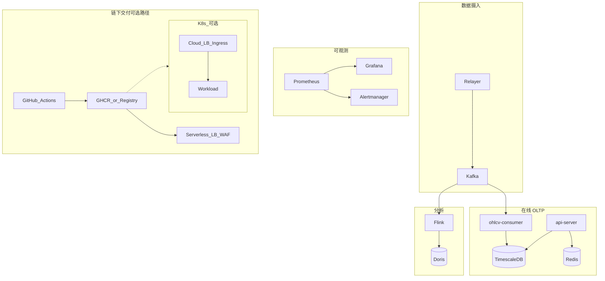

# AnchorStock 端到端改造计划

本文档描述 **目标架构与 CI/CD 原则**（Web3 与链下系统并重）；附录含端口、环境变量与回滚占位。**具体文件名与 workflow 以当前仓库为准**（若代码还原，以还原后树为准）。

**阅读说明**：先读 **§4 统一路线图**，再读 **§5.5 链上制品与合约流水线（Web3）** 与 **§5.3 链下交付**；跨链上与链下的共性工程能力见 **§6**。

---

## 目录

- [1. 背景与目标](#1-背景与目标)
- [2. 现状摘要](#2-现状摘要)
- [3. 目标架构](#3-目标架构)
- [4. 实施路线图](#4-实施路线图)
- [5. 能力规格（按主题）](#5-能力规格按主题)
  - [5.1 数据与分析](#51-数据与分析)
  - [5.2 可观测性](#52-可观测性)
  - [5.3 链下构建、交付与运行时](#53-链下构建交付与运行时)
  - [5.4 多云对照（摘要）](#54-多云对照摘要)
  - [5.5 链上制品与合约流水线（Web3）](#55-链上制品与合约流水线web3)
  - [5.6 告警与 OpenClaw](#56-告警与-openclaw)
  - [5.7 安全、密钥与边缘硬化](#57-安全密钥与边缘硬化)
  - [5.8 灰度、无停机与回滚索引](#58-灰度无停机与回滚索引)
- [6. CD 进阶实践与治理](#6-cd-进阶实践与治理)
  - [6.1 数据库模式变更自动化](#61-数据库模式变更自动化)
  - [6.2 特性开关](#62-特性开关)
  - [6.3 环境一致性与漂移检测](#63-环境一致性与漂移检测)
  - [6.4 部署后的自动化冒烟测试](#64-部署后的自动化冒烟测试)
  - [6.5 可观测性与自动回滚触发器](#65-可观测性与自动回滚触发器)
  - [6.6 安全与合规性扫描（DevSecOps）](#66-安全与合规性扫描devsecops)
  - [6.7 发布审核流（Deployment Governance）](#67-发布审核流deployment-governance)
- [7. 风险与依赖](#7-风险与依赖)
- [附录 A：服务端口一览](#附录-a服务端口一览)
- [附录 B：环境变量与密钥清单（占位）](#附录-b环境变量与密钥清单占位)
- [附录 C：回滚策略（占位）](#附录-c回滚策略占位)

---

## 1. 背景与目标

- **数据与分析**：在保留 Relayer → Kafka → OHLCV/TimescaleDB 主链路前提下，增加 **Flink 消费 Kafka**、写入 **Doris** 用于 OLAP/报表；**Redis** 不参与 Flink→Doris 必需路径（沿用 API 缓存）。
- **可观测性**：**Prometheus + Grafana**（可选 Alertmanager），覆盖中间件、Go 服务、Flink/Doris。
- **链上 vs 链下（必须分轨）**  
  - **链上变更的信任根** 是 **多签、时间锁、治理与人工审批**，**不是** Git 合并本身。详见 **§5.5**、附录 C。  
  - **链下应用交付** 是 **镜像构建 → 运行时部署（Serverless / VM / 可选 K8s）**，与合约升级 **流程独立、门禁可并列**。
- **链下交付（默认路径）**：前后端与 API 以 **容器镜像** 为契约；**优先** **Serverless + 云负载均衡 + WAF**（如 **Cloud Run / 类似形态** + HTTPS LB + Cloud Armor 等），即可满足多数 API/前端场景。详见 **§5.3**。
- **K8s（可选规模化路径）**：仅在 **多服务编排、复杂网络策略、强定制滚动** 等需求出现时引入 **托管 Kubernetes**；需承担 **控制面、节点、RBAC、网络策略、Ingress 证书** 等运维成本。**不是**「架构升级必上 K8s」。详见 **§5.3**、**§4**。
- **多云**：在统一镜像与配置契约下 **分阶段** 扩展；不追求单一流水线一次覆盖所有云。详见 **§5.4**。
- **发布**：**灰度** 与 **无停机**（流量拆分、多副本、健康检查）；Serverless 用 **traffic split** 等；K8s 用 **Ingress/Gateway 权重、金丝雀**（按需）。详见 **§5.8**。
- **密钥**：**托管 KMS**、Secret Manager；**主网签名材料不进长期 CI**。详见 **§5.5、§5.7**。
- **自动化**：**GitHub Actions** 负责 **构建、扫描、测试网/预发**；**禁止** 因告警或 CI **自动向主网发送写交易**（**§5.6**）。OpenClaw 仅 **通知 / 人类审批 / 只读运维** 场景优先。
- **CD 进阶**（DB 迁移、Feature Flags、GitOps、冒烟、自动回滚、DevSecOps、发布门禁）：见 **§6**，与 **§4 路线图** 中「演进」行挂钩，**分项落地、不要求一次全集**。

---

## 2. 现状摘要

以下为 **典型 Mono-repo 可能包含** 的形态，**以你还原后的仓库树为准**。

| 领域 | 说明 |
|------|------|
| 本地编排 | 常见：`docker-compose` 编排 Kafka、DB、Redis 等 |
| 可观测 | 常见：Prometheus、Grafana、Alertmanager（或等价） |
| 分析（可选） | Flink、Doris 等（按需启用） |
| 后端 | Go 服务：API、Relayer、Consumer、Bot 等 |
| 指标 | HTTP `/metrics` 或独立 `METRICS_ADDR` |
| CI | 常见：`ci.yml`、镜像构建 workflow、云部署 workflow、**合约** `forge` workflow（若存在） |
| CD | **链下**：云无服务化或 VM/K8s；**链上**：测试网自动化程度因团队而异，**主网** 推荐 **多签 + 非 CI 持钥** |
| 文档 | 常见：`infra/gcp/README.md`、合约 Runbook、`infra/openclaw/README.md` 等（路径随仓库） |

---

## 3. 目标架构

### 3.1 链上与链下 CI/CD 分轨

### 3.2 运行时与数据面（示意）

逻辑上 **CI 构建** → **链下**：镜像 → **Serverless / K8s（可选）**；**链上**：测试网验证 → **多签/治理** → 主网执行。观测栈独立。

---

## 4. 实施路线图

下列为 **统一路线图**（合并原「基础阶段」与「演进阶段」）：**无完成状态列**，仅描述 **目标能力** 与 **推荐顺序**。每一行可 **独立规划验收**；**禁止** 假设一次性落地全部项。

| 顺序 | 主题 | 目标能力（验收导向） |
|------|------|----------------------|
| 1 | **可观测与开发体验** | 本地/预发可跑通观测栈；Prometheus 规则、Grafana 大盘；Go 暴露 `/metrics`（或等价） |
| 2 | **容器构建与首云 CD** | 镜像构建与 Registry；**无服务化部署**（如 Cloud Run）+ **OIDC/WIF**；部署文档与变量/Secret 约定 |
| 3 | **数据分析链路** | Kafka 契约、Flink/Doris（或团队选定栈）与文档 |
| 4 | **智能合约流水线** | `forge`  fmt/build/test 门禁；**测试网** 部署策略；**主网不长期存私钥于 CI**（见 **§5.5**） |
| 5 | **告警与运营出口** | Alertmanager → Webhook/IM；**severity 分级**；**禁止告警自动触发链上写**（见 **§5.6**） |
| 6 | **边缘与硬化** | **HTTPS LB + WAF**、KMS/Secret、Mainnet Runbook / 门禁（若仓库提供 workflow） |
| 7 | **可选：K8s 规模化** | 托管集群、Ingress/Gateway + **云厂商 LB**、多副本、PDB、**OIDC 部署身份**；**不**与「首云 Serverless」互斥 |
| 8 | **可选：GitOps** | Helm/Kustomize + Argo CD 或 Flux；配置漂移对策 |
| 9 | **可选：多云与灰度工程化** | 第二云模板、OIDC 对齐；灰度/金丝雀 Runbook 与流水线参数 |
| 10 | **演进：§6 能力择要** | 从 **§6** 中选 **DB 迁移、Feature Flags、冒烟、镜像扫描门禁、自动回滚** 等 **按风险逐项** 落地 |

**原则**：每阶段 **可演示、可回滚、可交接**；**K8s / 多云 / GitOps** 均为 **可选增强**，不是前置条件。

---

## 5. 能力规格（按主题）

### 5.1 数据与分析

- Kafka topic 与生产一致（默认 `stock-prices`）；Flink 独立 **consumer group**（如 `flink-doris-sink`）。
- Doris：`ops/analytics/doris/schema.sql`；Flink：`ops/analytics/flink/README.md`、`ops/analytics/flink/kafka_to_doris.sql`。
- 本地：`docker compose` 合并 `docker-compose.yml` 与 `docker-compose.analytics.yml`（若存在；资源占用高，按需）。

### 5.2 可观测性

- 与主栈并行启动 observability compose（路径以仓库为准）。
- Prometheus：`docker/prometheus/prometheus.yml`；规则：`docker/prometheus/rules/anchorstock.yml`（支持 **warning / critical** 等分级，与 Alertmanager 路由配合）。
- Grafana：预置数据源与大盘（如 `docker/grafana/` 下 provisioning）。

### 5.3 链下构建、交付与运行时

**构建**

- CI 构建容器镜像并推送到 **GHCR 或团队 Registry**；合约侧 **`forge`/Slither** 等见 **§5.5**。

**默认推荐：Serverless + 负载均衡 + 边缘安全**

- **Cloud Run（或等价）** + **外部 HTTPS 负载均衡** + **WAF**（如 Cloud Armor）即可覆盖多数 API/前端；与 `infra/gcp/production-hardening.md` 类文档对齐（若存在）。

**可选：托管 Kubernetes**

- 适用于多服务强编排、复杂 **NetworkPolicy**、自定义滚动策略等；**Ingress / Gateway API** 对接 **云厂商负载均衡**，**多副本、PDB、HPA**；部署身份 **OIDC + 云 IAM**，**禁止** 长期 kubeconfig 明文入库。

**链下高敏组件（Relayer / Oracle / 价格相关）**

- **CI**：集成测试、配置 schema 校验、**RPC URL 与密钥** 不进日志。  
- **运行**：**速率限制**、**密钥轮换**、**健康检查**、与 **链上读一致性** 监控；升级与 **§5.5** 合约变更 **协调发布**（避免单边改配置导致资金/价格风险）。

### 5.4 多云对照（摘要）

| 云 | 无状态 Web/API | 有状态与消息（示例） |
|----|----------------|----------------------|
| **Google** | Cloud Run、**GKE** | Cloud SQL、Memorystore、Kafka 自建/托管 |
| **AWS** | ECS、**EKS**、App Runner | RDS、ElastiCache、MSK |
| **Azure** | Container Apps、**AKS** | Azure Database for PostgreSQL、Redis、Event Hubs |
| **阿里云** | SAE、**ACK** | RDS、云 Redis、Kafka |

镜像建议统一由 **单一 Registry** 产出；各云 **OIDC/IRSA/Workload Identity** 对接 CI，避免长期云密钥入库。

### 5.5 链上制品与合约流水线（Web3）

**信任边界**

- **主网私钥**、**多签持有者** **不得** 作为 GitHub **长期** Secret 用于自动广播；生产执行走 **多签 Safe / 时间锁 / 硬件钱包** 等链外流程。CI 仅适合 **Anvil 本地**、**测试网水龙头限额** 等。

**构建与可复现**

- **Foundry** 版本与 `lib` 子模块 **commit 固定**；发布工件（bytecode、部署脚本哈希）**可追溯**；可选与 **审计报告** 中版本 **对齐**。

**安全扫描（门禁建议）**

- **Slither**（及团队选定的 Solidity 静态分析）纳入 **PR/主干**；与 **§6.6** 容器/npm/go 扫描 **互补**。

**测试策略**

- 单元 / 模糊测试；**Fork 测试**（可选，注意 **RPC 限额与成本**）；**链 ID** 与 **测试网 → 主网** 晋升规则在团队内成文。

**治理与发布**

- 可升级 **代理** 时明确 **admin、时间锁、Pause**；应急与回滚见 **附录 C** 与仓库内 **Mainnet Runbook**（若存在）。

**供应链**

- `forge-std` / OpenZeppelin 等 **锁定版本**；演进项：**SBOM**、**SLSA / Artifact Attestation**。

**前端与钱包**

- `NEXT_PUBLIC_*` 为构建期注入，**无秘密**；**CSP**、**正确链 ID / RPC**；**敏感逻辑不得仅依赖前端**。

**与 GitHub Actions 的映射（若仓库中存在）**

- 常见：`contracts-deploy.yml`（PR 上跑 fmt/build/test；测试网 **workflow_dispatch**）；`contracts-mainnet-gate.yml`（仅 **门禁**、**不广播**）。具体以还原后 `.github/workflows/` 为准。

### 5.6 告警与 OpenClaw

- Alertmanager 配置（如 `docker/alertmanager/alertmanager.yml`）支持 **分级路由**（如 `openclaw` / `openclaw_pager`）；本地覆盖见 `docker/alertmanager/README.md`。
- **硬原则**：**告警、OpenClaw、CI 均不得自动向主网（或生产链）发送写交易**；链上应急须 **人类 + 多签** 流程。策略见 `infra/openclaw/README.md`。

### 5.7 安全、密钥与边缘硬化

- **KMS / Secret Manager**、轮换与审计；与云部署文档中的 Secret 挂载一致。
- **WAF / 边缘**：如 `infra/gcp/production-hardening.md`（HTTPS 负载均衡 + Cloud Armor 等）。

### 5.8 灰度、无停机与回滚索引

- **灰度**：流量百分比、Header、**Cloud Run traffic split**、K8s **Ingress 权重 / 金丝雀**（若已采用 K8s）。
- **无停机**：多副本、滚动更新、就绪探针；DB **expand/contract**。
- **回滚**：镜像 **digest**、切流量、K8s `rollout undo`；合约见 **附录 C**。

---

## 6. CD 进阶实践与治理

以下为 **链上与链下共性** 的工程能力，与 **§5.8**、密钥、附录 C 互补；与 **§4 路线图第 10 行** 挂钩，**按优先级分项落地**，不要求一次实现。

### 6.1 数据库模式变更自动化

Flyway / Liquibase / Prisma Migrate 等；**向前兼容**（expand → migrate → contract）；生产回滚策略与数据安全由团队规范。

### 6.2 特性开关

解耦部署与发布；暗发布、熔断；可与灰度组合。

### 6.3 环境一致性与漂移检测

不可变基础设施；**GitOps**；与 **§4** 可选 GitOps 阶段对齐。

### 6.4 部署后的自动化冒烟测试

健康检查覆盖依赖；关键脚本失败时阻断切流或触发回滚。

### 6.5 可观测性与自动回滚触发器

部署后观测 SLO；阈值触发回滚（与人审、特性开关配合）。**链上回滚** 不等同于应用回滚，须遵守 **§5.5**。

### 6.6 安全与合规性扫描（DevSecOps）

镜像扫描（如 **Trivy**）；npm/go 依赖审计；机密经 Secret Manager / KMS。

### 6.7 发布审核流（Deployment Governance）

质量门禁；**谁在何时将何版本部署到何环境** 的审计（含 **合约治理** 与 **链下发布** 两套记录若需要）。

---

## 7. 风险与依赖

**Web3 特有风险**

- **合约升级错误**、**代理指向错误实现**、**权限被接管**；依赖 **审计、多签、时间锁、可暂停**（若协议支持）。
- **预言机 / 喂价被篡改或延迟**；Relayer **错误上链**；须 **监控、冗余源、人为升级纪律**。
- **RPC 单点、密钥泄露、测试网水龙头与 CI 泄露**。

**通用与基础设施**

- 以太坊 RPC 限额与费用；密钥轮换。
- Flink/Doris 资源与运维成本。
- OpenClaw：**审批流**、**只读默认**；与 **§5.6** 一致。
- **K8s（若采用）**：控制面/节点升级、**NetworkPolicy**、**RBAC**、证书与运维成本——**仅在选用 K8s 时** 纳入。
- **多云**：成本与安全基线。
- **灰度 / 双版本**：数据契约与路由一致性。
- **KMS**：区域、轮换与合规。
- **§6**：自动回滚误杀、GitOps 冲突、门禁拖慢交付等，需分项缓解。

---

## 附录 A：服务端口一览

| 服务 | 默认端口 | 说明 |
|------|-----------|------|
| Kafka (宿主机) | 9092 | `KAFKA_BROKER` |
| Kafka (容器内) | 9093 | Kafka UI / 内部 |
| TimescaleDB | 5432 | `DB_HOST` / `DB_PORT` |
| Redis | 6379 | |
| Kafka UI | 8082 | |
| Redis Commander | 8081 | |
| API Server | 3001 | `LISTEN_ADDR` 可配置 |
| Go 常驻进程 metrics | 9090 | `METRICS_ADDR` |
| Prometheus | 9099 | compose 映射 |
| Grafana | 3000 | |
| Alertmanager | 9093 | 映射主机端口 |
| Flink REST | 8088 | JobManager |
| Doris FE HTTP | 8030 | |
| Doris FE RPC | 9020 | |
| Doris BE | 8040 / 9060 | HTTP / heartbeat |

---

## 附录 B：环境变量与密钥清单（占位）

以下仅在部署介质中保存，**勿提交仓库**。

| 变量 / 密钥 | 用途 |
|-------------|------|
| `GCP_PROJECT_ID`、`GCP_REGION`、OIDC 相关 Secret | GCP 部署 |
| `GCP_KMS_KEY_RING`、`GCP_KMS_KEY_ID`（或 CMEK 全名） | Cloud KMS / 加密（按需） |
| `AWS_KMS_KEY_ARN`、`AWS_REGION` | AWS KMS（按需） |
| `RPC_URL`、`PRIVATE_KEY`、`ETHERSCAN_API_KEY` | 合约本地开发（**非主网长驻**） |
| 测试网部署 Secret（如 `DEPLOYER_PRIVATE_KEY`、`SEPOLIA_RPC_URL`） | 仅测试网 CI；**低权限、可轮换** |
| **多签 / 硬件钱包 / 主网资金操作** | **禁止** 作为 GitHub 长期 Plain Secret 用于自动广播 |
| `DATABASE_URL` / `DB_*` | TimescaleDB |
| `KAFKA_BROKER` | Kafka |
| `REDIS_*` | Redis（可选） |
| `STOCK_API_KEY` | Relayer 等 |
| `METRICS_ADDR` | Go metrics（可选） |
| OpenClaw Webhook URL / Token | Alertmanager 出站 |

---

## 附录 C：回滚策略（占位）

| 场景 | 建议动作 |
|------|----------|
| 新版本 API 故障 | 灰度切回；K8s `rollout undo` 或固定 digest；Cloud Run 回滚 revision / traffic split |
| 合约升级错误 | 多签与时间锁；**Pause**（若具备）；**不可** 仅依赖 CI 回滚链上状态 |
| Flink/Doris 异常 | 暂停 Flink；保留 Kafka offset；checkpoint 恢复 |
| 告警风暴 | Alertmanager `inhibit_rules`；临时阈值；限制 OpenClaw **写权限** |

---

*本文档描述目标与约束；具体脚本与 workflow 以仓库当前树为准。*
